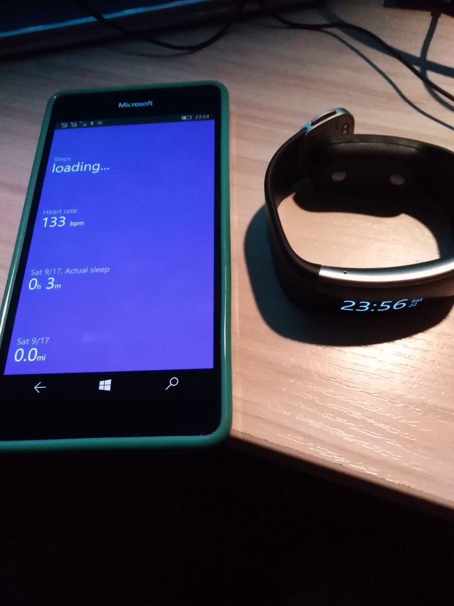

# MSBandCompanionApp

MSBandCompanionApp :: my fork of MicrosoftBandDev/companion-app solution

## About the original

Microsoft Band. Planned as multi-platform app (UNO Platform used). Draft / Not ready yet.

## Screenshots

## Tech. moments

- W10M compatibility started to realize... :)
- Win. os build: 15063 (!)

## Status

- R.E. +- 50%
- Design - 5%
- Tech. project - 25 %
- Dev - 20%
- Intro 0%

## Bugs / Problems
 
- Huge codebase. 
- Idk all solution architecture... RnD takes a lot of time.
- The code partially decompiled :( 
- Dramatic Blootooth lib uncompatibility with Android platform, so, no multi-platform right now (only UWP...)

## References

https://github.com/MicrosoftBandDev/companion-app

## ..

AS IS. MIT Licence. No support. DIY

## .

[m][e] 2022