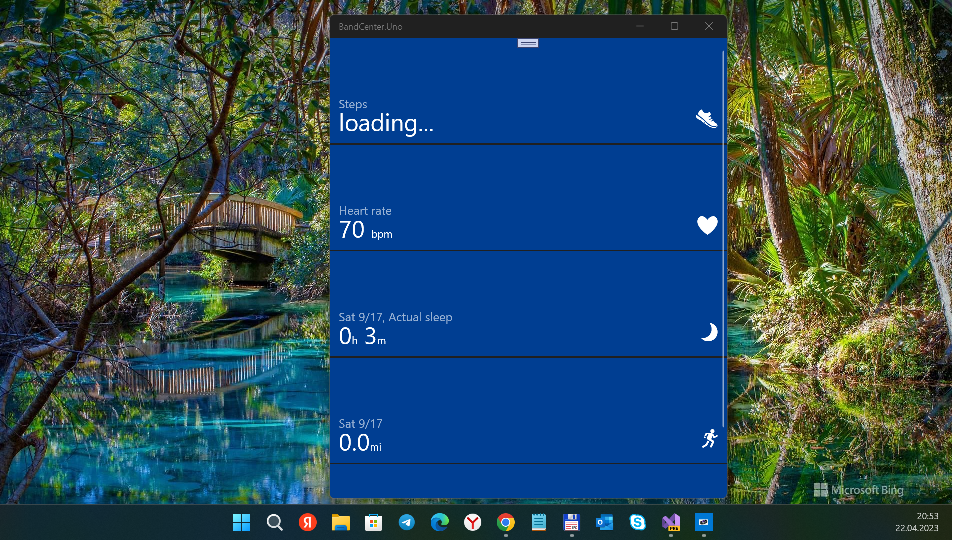

# MSBandAppUno (Band Center codename; MS Band Companion App rework)

A "lite/partial replacement" of the Microsoft Health app for Microsoft Band 1/2




## Building the project
My fork of ["Band Center" solution](https://github.com/MicrosoftBandDev/companion-app) uses UNO "framework", 
which is still in the preview stages... 

Once you have the development environment set up, you're ready to clone the repo.
```bash
git clone --recursive https://github.com/mediaexplorer74/MSBandCompanionApp
```

You need Visual Studio 2022 *Preview* to assemble (build) my solution.

## Status
- UWP "target" : 

  16299->15063 & 2 .Uno sub-projects cut off (I merged them with UWP); 
  
  W11 was ok but I demaged it a littly; 
  
  W10M - installed ok, but failed to start

- Android "target": persists, but not tested

- iOS, MACOS, Tizen, WASM are only "stubs" 

## ..
AS IS. No support. DIY

## .
[m][e] 2023
